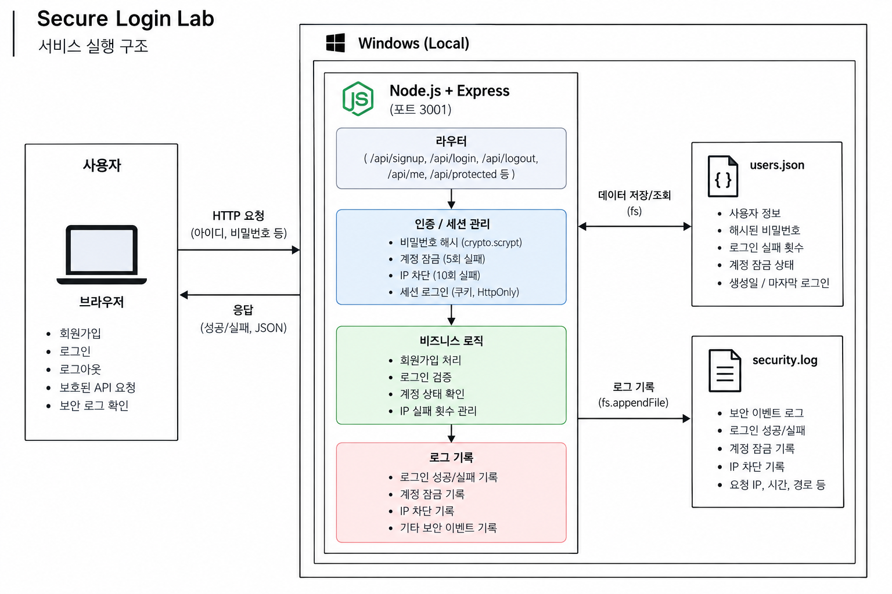

## 🏗 서비스 실행 구조



### 동작 흐름

사용자
→ Node.js + Express
→ 로그인 인증 및 보안 검사
→ users.json 데이터 조회/저장
→ security.log 보안 이벤트 기록
→ 로그 검색 및 통계
→ 보안 대시보드

### 주요 보안 기능

- 비밀번호 `scrypt` 해시
- 로그인 실패 횟수 관리
- 계정 5회 실패 시 잠금
- IP 로그인 실패 횟수 추적
- IP 10회 실패 시 임시 차단
- HttpOnly 쿠키 기반 세션 관리
- 로그인 및 보안 이벤트 로그 기록
- WAF를 이용한 SQL Injection / XSS / Path Traversal 패턴 검사
- Rate Limiting을 통한 로그인 요청 횟수 제한

---

## 🛡 WAF

서버로 들어오는 요청을 검사하여
학습용으로 정의한 공격 패턴이 발견되면 요청을 차단합니다.

### 검사 대상

- SQL Injection
- XSS
- Path Traversal

예를 들어 `<script>` 패턴이 포함된 요청이 들어오면
`WAF_BLOCK` 이벤트를 생성하고 요청을 차단합니다.

---

## 🚦 Rate Limiting

같은 IP에서 짧은 시간 동안 로그인 요청을 반복하는 경우
요청 횟수를 제한합니다.

현재 학습용 설정:

- 제한 시간: 1분
- 최대 요청: 5회
- 초과 시 HTTP `429` 응답

차단된 요청은 `RATE_LIMIT_BLOCK` 이벤트로 기록됩니다.

---

## 📋 보안 로그

보안 이벤트는 `security.log`에 JSON 형식으로 저장됩니다.

주요 로그 종류:

- `WAF_ALLOW`
- `WAF_BLOCK`
- `LOGIN_REQUEST`
- `LOGIN_FAIL`
- `LOGIN_SUCCESS`
- `RATE_LIMIT_BLOCK`

---

## 🔎 로그 검색

로그 API를 이용해 특정 종류의 로그 또는 IP를 기준으로 검색할 수 있습니다.

### 전체 로그

```text
http://localhost:3000/logs

메인 페이지
http://localhost:3000/

보안 대시보드
http://localhost:3000/dashboard

설정 페이지
http://localhost:3000/settings
